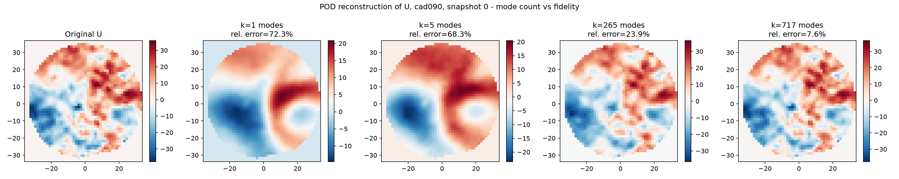

# AI for Thermal & Fluid Engineering

**CFD & Thermal Engineering × Scientific Machine Learning**

Combustion • Conjugate Heat Transfer • Aerodynamics • Battery & Electronics Cooling • Surrogate Modeling • Physics-Informed ML • Digital Twins • Neural Operators

I'm [Maheswaran Pasupathi](https://github.com/maheswaran-pasupathi), a CFD/thermal simulation engineer with 9 years in commercial CFD tools (STAR-CCM+, CONVERGE, GT-SUITE) and Python/Java automation, including workflows that cut simulation turnaround by 40–50%. Like a lot of CFD engineers right now, I've found the path into AI/ML genuinely hard to figure out — scattered tutorials, unclear where existing physics knowledge actually transfers, and very little written for someone coming from the CFD side rather than a pure data-science background.

This repo is me learning that transition in public, using only free and open tools — no commercial CFD or ML software required to follow along — so other CFD engineers and aspirants facing the same struggle have something concrete to learn from, question, or improve.

This is a public, in-progress portfolio — projects are added and updated as they're built, not dumped in finished. Every project favors **physical interpretation over model-accuracy claims** and states clearly what stage it's at.

## Why this repo exists

Most "AI for CFD" content I've found online is either pure ML with no engineering grounding, or pure CFD with no ML — and very little of it is written from the perspective of someone actually stuck between the two. I'm trying to close that gap here: real physics datasets, the engineering meaning explained for every result, and honesty about where a model's predictions can and can't be trusted.

## Portfolio

| # | Project | Physics | AI/ML Method | Status | Preview |
|---|---|---|---|---|---|
| 01 | [In-Cylinder Flow Reconstruction](projects/01-enginebench-piv/) | Engine PIV flow, tumble/vortex structure, cycle variability | POD/PCA → regression → reconstruction | 🟢 Complete |  |
| 02 | [Spray & Combustion ML](projects/02-ecn-spray-combustion/) | Ignition delay, spray penetration, lift-off length | Random Forest / XGBoost + SHAP | ⚪ Planned | - |
| 03 | [Data Center Cooling Surrogate](projects/03-ecoqube-datacenter-cooling/) | Thermal surrogate + cooling control/optimization | Regression + optimization | ⚪ Planned | - |
| 04 | [Vehicle Aerodynamics AI](projects/04-drivaernet-aero/) | Drag coefficient prediction from geometry | XGBoost + SHAP explainability | ⚪ Planned | - |
| 05 | [Electronics Hotspot Prediction](projects/05-electronics-thermal-cnn/) | Power/heat-source layout → temperature map | CNN | ⚪ Planned | - |
| 06 | [Thermal Digital Twin (flagship)](projects/06-transient-cht-digital-twin/) | Transient conjugate heat transfer, battery/electronics cooling transfer | U-Net → FNO/DeepONet | ⚪ Planned | - |
| 07 | [Scientific ML / Neural Operators](projects/07-cfdbench-neural-operator/) | Canonical CFD PDE solution fields | Fourier Neural Operator | ⚪ Planned | - |

I follow the same structure for every project card: **Engineering problem → Physics baseline → Dataset → Method → Result → Error analysis → Engineering conclusion**, with one visual result and full source attribution to the original dataset/paper.

## Community

I also want this repo to be a shared learning space for CFD engineers — experienced or just starting out — who want to pick up AI/ML without losing the physics grounding that makes CFD work trustworthy.

- **Discussions** are open — ask questions, suggest datasets, share your own approach to any of the problems above, or point out where a result looks physically wrong.
- **Issues** are open for dataset suggestions, method suggestions, or spotted errors.
- See [CONTRIBUTING.md](CONTRIBUTING.md) if you'd like to contribute a notebook, fix, or project card of your own.

If you're a CFD/thermal engineer curious about ML, or an ML person curious about CFD, you're in the right place.

## Let's collaborate

If this resonates with you — you're a CFD engineer trying to figure out this same transition, or you've already found part of the way through — I'd like to hear from you. [Follow/connect on LinkedIn](https://www.linkedin.com/in/srimahes) and let's discuss: what's actually working, what resources helped, and how we as a CFD simulation community can give back to each other during this shift, without commercial tooling gatekeeping who gets to learn it.

## Datasets used (with attribution)

All datasets are public/research datasets, used with attribution to their original authors. Links and citations are in each project's own README. No proprietary or employer data is used anywhere in this repository.

## License

Code in this repository is released under the [MIT License](LICENSE). Datasets remain under their original licenses — see each project folder for source and license details.
