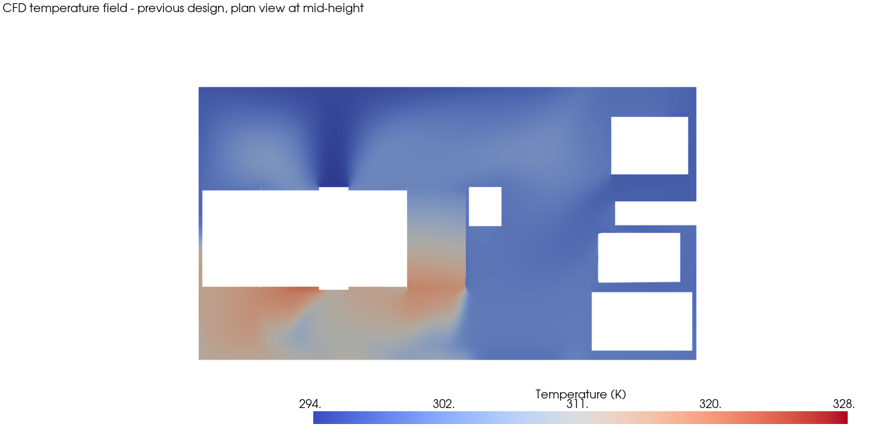

# AI for Thermal & Fluid Engineering

**CFD & Thermal Engineering × Engineering Automation × Scientific Machine Learning**

Combustion • Conjugate Heat Transfer • Aerodynamics • Battery & Electronics Cooling • Surrogate Modeling • Physics-Informed ML • Digital Twins • Neural Operators

I'm [Maheswaran Pasupathi](https://github.com/maheswaran-pasupathi), a CFD/thermal simulation engineer with extensive experience in commercial simulation tools (STAR-CCM+, CONVERGE, GT-SUITE) and hands-on engineering automation using Python and Java. Automation has been a significant part of my engineering work — building workflows around simulation setup, execution, post-processing, data handling, and repetitive CAE tasks.

I'm now extending that engineering and automation foundation into **AI/ML for CFD, thermal and simulation problems**. What I found during this transition is that learning ML concepts in isolation is only one part of the challenge. The harder and more useful question is: **how do we translate those concepts into physically meaningful engineering workflows?**

For a CFD or thermal engineer, that creates practical questions that generic ML tutorials rarely answer: How should a velocity, pressure or temperature field be represented for ML? What should be a feature and what should be a target? When is a simple regression model enough, and when do POD/PCA, CNNs, surrogate models, PINNs or neural operators make sense? How do we distinguish a statistically good prediction from a physically credible one? And where can AI genuinely complement CFD — through reduced-order models, optimization, reconstruction or digital twins — without treating it as a replacement for engineering physics?

This repository documents how I'm working through those questions using public engineering datasets and reproducible projects. The approach is deliberately **physics first**: understand the engineering problem and data, formulate the ML problem, select an appropriate method, validate the result against engineering expectations, examine limitations, and only then discuss what the model may be useful for.

I'm sharing the transition in public because I expect many CFD and thermal engineers face the same gap: the AI/ML concepts are understandable, but implementing them meaningfully in their own engineering domain is much less straightforward. My aim is for these projects to provide concrete examples that others can reproduce, question, improve, and use as a starting point for their own transition into AI-enabled engineering.

This is a public, in-progress portfolio — projects are added and updated as they're built, not presented as finished before the evidence exists. Every project favors **physical interpretation over model-accuracy claims** and states clearly what stage it's at.

## Why this repo exists

There is plenty of excellent material for learning ML algorithms and plenty for learning CFD. The gap I want to explore is the engineering layer between them: **turning simulation and experimental data into useful ML problems without losing the physics that makes the result trustworthy.**

Each project therefore follows a consistent path: **Engineering problem → Physics baseline → Dataset → ML formulation → Method → Result → Error analysis → Engineering conclusion.** The objective is not to use the most advanced algorithm available; it is to understand where a method adds engineering value, where it fails, and what evidence is required before trusting it.

## Portfolio

| # | Project | Physics | AI/ML Method | Status | Preview |
|---|---|---|---|---|---|
| 01 | [In-Cylinder Flow Reconstruction](projects/01-enginebench-piv/) | Engine PIV flow, tumble/vortex structure, cycle variability | POD/PCA → regression → reconstruction | 🟢 Complete |  |
| 02 | [Spray & Combustion ML](projects/02-ecn-spray-combustion/) | Ignition delay, spray penetration, lift-off length | Random Forest / XGBoost + SHAP | 🟢 Complete |  |
| 03 | [Data Center Cooling Surrogate](projects/03-ecoqube-datacenter-cooling/) | Thermal surrogate + cooling control/optimization | Random Forest + grid-search optimization | 🟢 Complete |  |
| 04 | [Vehicle Aerodynamics AI](projects/04-drivaernet-aero/) | Drag coefficient prediction from geometry | XGBoost + SHAP explainability | ⚪ Planned | - |
| 05 | [Electronics Hotspot Prediction](projects/05-electronics-thermal-cnn/) | Power/heat-source layout → temperature map | CNN | ⚪ Planned | - |
| 06 | [Thermal Digital Twin (flagship)](projects/06-transient-cht-digital-twin/) | Transient conjugate heat transfer, battery/electronics cooling transfer | U-Net → FNO/DeepONet | ⚪ Planned | - |
| 07 | [Scientific ML / Neural Operators](projects/07-cfdbench-neural-operator/) | Canonical CFD PDE solution fields | Fourier Neural Operator | ⚪ Planned | - |

## Community

I also want this repo to be a shared learning space for CFD engineers — experienced or just starting out — who want to pick up AI/ML without losing the physics grounding that makes CFD work trustworthy.

- **Discussions** are open — ask questions, suggest datasets, share your own approach to any of the problems above, or point out where a result looks physically wrong.
- **Issues** are open for dataset suggestions, method suggestions, or spotted errors.
- See [CONTRIBUTING.md](CONTRIBUTING.md) if you'd like to contribute a notebook, fix, or project card of your own.

If you're a CFD/thermal engineer curious about ML, or an ML person curious about CFD, you're in the right place.

## Let's collaborate

If this resonates with you — you're a CFD engineer working through the same transition, or you've already found part of the way through — I'd like to hear from you. [Follow/connect on LinkedIn](https://www.linkedin.com/in/srimahes) and let's discuss what is actually working, what resources helped, where physics and ML meet well, and where they do not.

## Running this locally

```
pip install -r requirements.txt
```

Covers the core dependencies (numpy, h5py, matplotlib, scikit-learn) used across projects, plus `kaggle` if you want to download a dataset yourself via the Kaggle API. Each project README lists its exact dataset and any project-specific dependency beyond this list.

## Datasets used (with attribution)

All datasets are public/research datasets, used with attribution to their original authors. Links and citations are in each project's own README. No proprietary or employer data is used anywhere in this repository.

## License

Code in this repository is released under the [MIT License](LICENSE). Datasets remain under their original licenses — see each project folder for source and license details.
