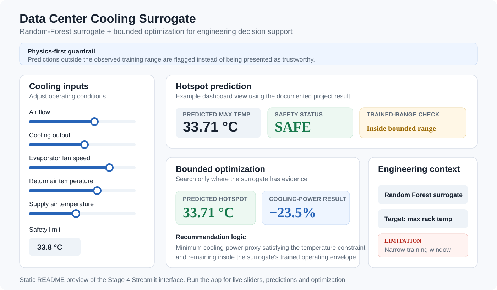

# AI for Thermal & Fluid Engineering

### CFD & Thermal Engineering × Engineering Automation × Scientific Machine Learning

**Combustion** · **Heat Transfer & CHT** · **Aerodynamics** · **Thermal Management** · **Surrogate Modeling** · **Explainable ML** · **Digital Twins** · **Neural Operators**

---

## A glimpse of what is inside

<table>
<tr>
<td width="33%" align="center">
<a href="projects/01-enginebench-piv/"><strong>In-Cylinder Flow Reconstruction</strong></a><br><br>
<br>
<sub>PIV → POD/PCA → regression → reconstructed flow</sub>
</td>
<td width="33%" align="center">
<a href="projects/02-ecn-spray-combustion/"><strong>Spray & Combustion ML</strong></a><br><br>
<br>
<sub>Experimental spray/combustion data → ML → SHAP interpretation</sub>
</td>
<td width="33%" align="center">
<a href="projects/03-ecoqube-datacenter-cooling/"><strong>Thermal Surrogate & Optimization</strong></a><br><br>
<br>
<sub>Thermal surrogate → hotspot prediction → bounded cooling recommendation</sub>
</td>
</tr>
</table>

**Three different engineering problems. Three different data structures. Three different ML formulations. One common rule: the result still has to make physical sense.**

---

## About me — still fascinated by the engineering problem

I'm [Maheswaran Pasupathi](https://github.com/maheswaran-pasupathi), a CFD and thermal simulation engineer who is still fascinated by a deceptively simple question:

> **Why is the physics behaving this way — and can we understand it better, faster, or more systematically?**

That curiosity has taken me through combustion, fluid flow, conjugate heat transfer, aerodynamics and thermal-management problems. Along the way, I worked heavily on **engineering automation with Python and Java** because I found myself asking another question:

> **If an engineer has to repeat the same simulation task again and again, why should the engineer be the automation?**

That led to automation around:

- simulation setup and execution;
- engineering data processing;
- automated post-processing;
- repetitive CAE workflows;
- Python/Java simulation utilities and workflow orchestration.

Now the next question interests me:

> **Can AI/ML help us extract more engineering insight from simulation and experimental data without losing the physics that makes the answer trustworthy?**

That is the transition documented in this repository.

---

## The part that was not obvious

Learning an ML algorithm is one thing. **Turning it into a useful CFD or thermal-engineering problem is another.**

The questions I repeatedly encountered were not only about Python or model training:

| Engineering question | Why it matters |
|---|---|
| How should a velocity, pressure or temperature **field** become ML data? | CFD data is spatial, structured and physics-dependent — not a typical spreadsheet. |
| What should be the **feature** and what should be the **target**? | A poorly formulated engineering question produces a meaningless ML problem. |
| When is simple regression enough? | More complex ML is not automatically better engineering. |
| When do POD/PCA, CNNs, surrogates, PINNs or neural operators make sense? | The representation and physics should influence the method. |
| Is a good R²/RMSE also a **physically credible prediction**? | Statistical accuracy alone does not establish engineering trust. |
| Has the model learned physics or only correlation? | Generalization and extrapolation matter in design work. |
| Where can AI complement CFD — and where should it not? | The objective is engineering value, not replacing physics with AI. |

This repository is my practical way of working through those questions rather than stopping at generic ML examples.

---

## My working rule: physics first

<table>
<tr>
<td align="center"><strong>1. ENGINEERING<br>PROBLEM</strong><br><sub>What are we actually trying to understand?</sub></td>
<td align="center">→</td>
<td align="center"><strong>2. PHYSICS<br>BASELINE</strong><br><sub>What behavior should we expect?</sub></td>
<td align="center">→</td>
<td align="center"><strong>3. DATA<br>UNDERSTANDING</strong><br><sub>What does the dataset physically represent?</sub></td>
<td align="center">→</td>
<td align="center"><strong>4. ML<br>FORMULATION</strong><br><sub>Features, targets, representation and method</sub></td>
</tr>
<tr>
<td align="center"><strong>8. ENGINEERING<br>CONCLUSION</strong><br><sub>What can we actually use?</sub></td>
<td align="center">←</td>
<td align="center"><strong>7. LIMITATIONS &<br>ERRORS</strong><br><sub>Where does it fail?</sub></td>
<td align="center">←</td>
<td align="center"><strong>6. PHYSICAL<br>VALIDATION</strong><br><sub>Does the prediction make engineering sense?</sub></td>
<td align="center">←</td>
<td align="center"><strong>5. MODEL &<br>RESULT</strong><br><sub>Train, test and quantify performance</sub></td>
</tr>
</table>

**The ML model sits inside the engineering workflow — not the other way around.**

---

## Portfolio

| # | Project | Engineering problem | AI/ML approach | Status |
|---|---|---|---|---|
| 01 | [In-Cylinder Flow Reconstruction](projects/01-enginebench-piv/) | Reconstruct and interpret in-cylinder PIV flow structures and variability | POD/PCA → regression → reconstruction | **Complete** |
| 02 | [Spray & Combustion ML](projects/02-ecn-spray-combustion/) | Understand ignition delay, spray penetration and lift-off behavior | Random Forest / XGBoost + SHAP | **Complete** |
| 03 | [Data Center Cooling Surrogate](projects/03-ecoqube-datacenter-cooling/) | Build a thermal surrogate and explore cooling-control optimization | Random Forest + grid-search optimization | **Complete** |
| 04 | [Vehicle Aerodynamics AI](projects/04-drivaernet-aero/) | Connect vehicle geometry/design information to aerodynamic drag | XGBoost + SHAP explainability | Planned |
| 05 | [Electronics Hotspot Prediction](projects/05-electronics-thermal-cnn/) | Predict temperature fields/hotspots from power and heat-source layout | CNN | Planned |
| 06 | [Thermal Digital Twin](projects/06-transient-cht-digital-twin/) | Fast prediction of transient conjugate heat-transfer behavior | U-Net → FNO/DeepONet | Planned |
| 07 | [Scientific ML / Neural Operators](projects/07-cfdbench-neural-operator/) | Learn fast mappings for canonical CFD solution fields | Fourier Neural Operator | Planned |

---

## What I am trying to learn through the portfolio

Instead of building seven disconnected ML demos, the projects deliberately move across different engineering representations:

**Experimental vectors** → **spatial flow fields** → **thermal responses** → **geometry/design spaces** → **temperature maps** → **transient fields** → **operator learning**

The progression lets me explore:

- reduced-order representations of CFD/PIV fields;
- explainable ML for combustion and spray physics;
- surrogate modeling and engineering optimization;
- geometry-to-performance relationships in aerodynamics;
- image/field-based thermal prediction;
- transient thermal digital twins;
- Scientific ML and neural operators.

---

## Why I am sharing this

The AI/ML concepts themselves are increasingly accessible. The difficult part for many simulation engineers is the bridge from:

> **“I understand what this ML method does.”**
>
> to
>
> **“I know how to formulate and validate a meaningful engineering problem with it.”**

I'm documenting that bridge openly so others facing the same transition can:

- reproduce the examples;
- question the assumptions;
- see what worked and what did not;
- compare the ML result with the underlying physics;
- improve the approach rather than simply copy a notebook.

This is a **public, in-progress engineering portfolio**. Projects are updated as they are built and validated. I would rather document a limitation than hide it behind an attractive accuracy metric.

---

## Principles I want to keep throughout

- **Physics before algorithm selection**
- **Engineering interpretation before accuracy headlines**
- **Simple model before unnecessary complexity**
- **Validation before claiming usefulness**
- **Limitations and extrapolation stated explicitly**
- **AI complements engineering; it does not automatically replace it**
- **Public/research data only — no proprietary or employer data**

---

## Community

I want this repository to be useful to CFD/thermal engineers exploring AI/ML and to ML practitioners interested in engineering simulation.

- **Discussions** — technical questions, alternative approaches and useful datasets
- **Issues** — method suggestions, dataset suggestions and identified errors
- [CONTRIBUTING.md](CONTRIBUTING.md) — guidance for contributing a notebook, correction or project improvement

If a result here looks physically wrong, that is a useful discussion to have.

## Let's collaborate

If you are working on the same intersection of **CFD, thermal engineering, automation and Scientific ML**, I'd be interested in exchanging approaches and lessons learned.

[Connect with me on LinkedIn](https://www.linkedin.com/in/srimahes).

## Running this locally

```bash
pip install -r requirements.txt
```

Core dependencies include `numpy`, `h5py`, `matplotlib` and `scikit-learn`, with project-specific dependencies documented in the individual project READMEs.

## Datasets and attribution

All datasets are public/research datasets and remain credited to their original authors. Dataset links, papers and citations are maintained in each project README.

**No proprietary or employer data is used in this repository.**

## License

Code in this repository is released under the [MIT License](LICENSE). Datasets remain under their original licenses — see each project folder for source and license details.
