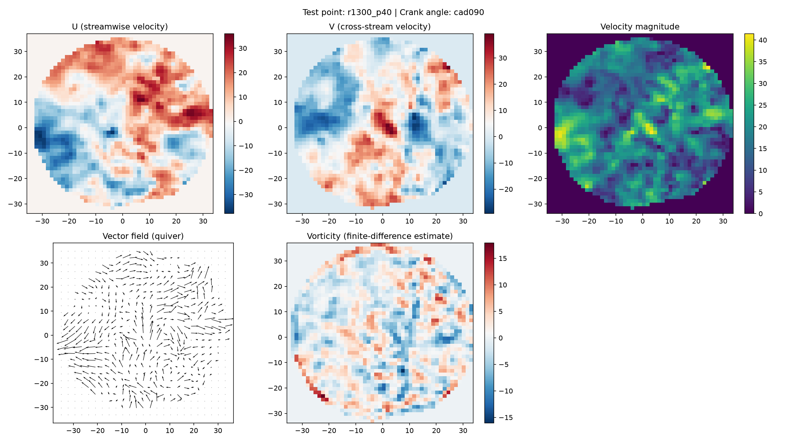
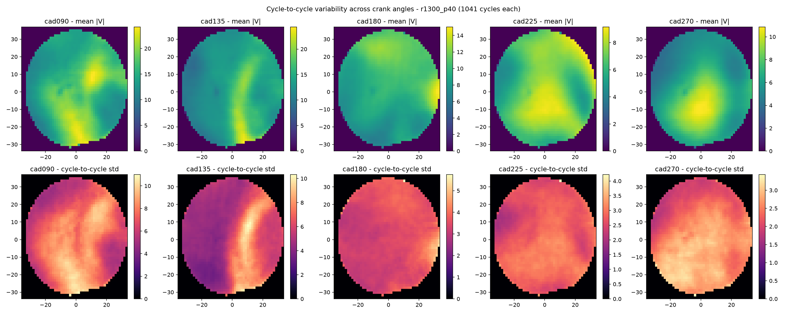
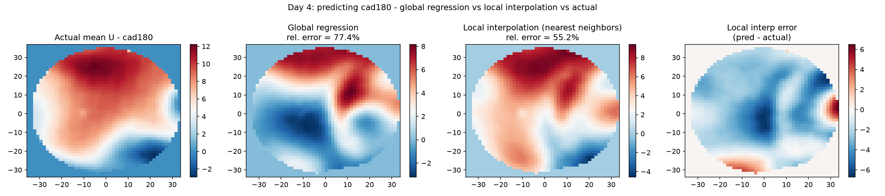
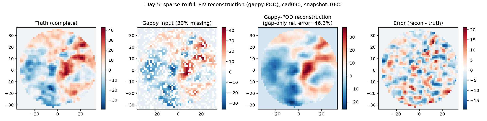

# Project 01 — In-Cylinder Flow Reconstruction & Prediction

**Status: 🟢 Stages 1-5 complete**


## Engineering problem
In-cylinder PIV flow structure (tumble/vortex behavior, cycle-to-cycle variability) directly affects mixture formation and combustion quality. Can ML reconstruct or predict flow fields from partial data, cheaply enough to be useful alongside experiment/CFD?

## Objective and outcomes
I set out to show that ML techniques on real in-cylinder PIV data can:
- Compress turbulent flow into a tractable representation
- Interpolate flow state from sparse conditions
- Reconstruct fields from incomplete measurements

What I got: a working pipeline covering all three, including where it's weak (Stage 4), reported honestly rather than hidden. This is Phase 1 - a small subset, method validated, not a production model. See Phase 2 below for the scale-up and why it matters industrially.

## Physics baseline
PIV plane, crank-angle-resolved U/V velocity, velocity magnitude, vector/quiver structure, vorticity, cycle-to-cycle variability.

## Dataset
- Oxford EngineBench: https://eng.ox.ac.uk/tpsrg/research/enginebench
- Kaggle (LSP Small, used here): https://www.kaggle.com/datasets/samueljbaker/enginebench-lsp-small
- Full dataset: https://www.kaggle.com/datasets/samueljbaker/enginebench
- Reference code: https://github.com/sambkr/EngineBench

**Official tutorials** (from the dataset authors - start here if you want the canonical walkthrough rather than my version):
1. [Browse the data](https://www.kaggle.com/code/samueljbaker/browsedata)
2. [Test different gap types](https://www.kaggle.com/code/samueljbaker/gaptester) (for inpainting)
3. [Train an inpainting model](https://www.kaggle.com/code/samueljbaker/trainingexample)

## Method
Data/physics exploration → cycle-to-cycle variability (EDA) → POD/PCA → regression from crank angle to POD coefficients → sparse-to-full reconstruction (gappy POD). Real data throughout: `r1300_p40`, 5 crank angles, 1041 cycles each.

## Result
| Stage | Task | Key result | Figure |
|---|---|---|---|
| 1 | Data/physics exploration | Real HDF5 structure, U/V/magnitude/quiver/vorticity |  |
| 2 | Cycle-to-cycle variability | Std of \|V\|: 5.36 (cad090) → 1.83 (cad270) |  |
| 3 | POD/PCA | 265/1041 modes for 90% energy; 5 modes already show large-scale structure |  |
| 4 | Crank angle → POD coeffs regression | Global regression 77.4% error vs 78.5% naive baseline; local interpolation improves to 55.2% |  |
| 5 | Sparse/gappy-POD reconstruction | 46.3% error on masked points, large-scale structure recovered |  |

Full code and my stage-by-stage notes: `stage1_explore_piv.py` … `stage5_sparse_reconstruction.py` and the matching `stage*_learning_notes.md` files.

## Error analysis
Reported per-stage since each answers a different question. Stage 4 is the clearest limitation: only 5 crank angles means a global regression can't learn the real crank-angle → flow relationship (77.4% error). Local interpolation between the two nearest angles did meaningfully better (55.2%), which told me the bottleneck was sampling density, not the method.

## Engineering conclusion
This flow is turbulence-dominated, not structure-dominated: POD needs hundreds of modes for high energy capture, yet the large-scale tumble/vortex is visually recoverable from a handful of modes or 70% of the points. That gap - large-scale structure vs. fine-scale turbulent energy - runs through Stages 3-5, and explains why crank-angle-only regression (Stage 4) underperforms: it can only ever predict the smooth part, not the variability I found in Stage 2.

## Genuine limitations, and what full-scale data would need
I used the Kaggle "LSP Small" subset: one operating condition (1300 RPM, 40 kPa), 5 crank angles, 390 MB, run on my own machine.
- **Stage 4 is data-starved, not a modeling failure** - 4 training points can't teach a real crank-angle → flow relationship.
- **The full dataset is 31 GB** (`LSP.h5` alone is 13.3 GB). Not something to download to a laptop - it needs a **Kaggle Notebook** running against the attached data, which is why the original plan specified Kaggle as the compute layer, not just a data source.

**Genuine open question:** if you're doing AI/ML-for-CFD work on a personal machine rather than a cluster, how do you handle tens-of-GB datasets? I'm moving this project to a Kaggle Notebook next - tell me how you've solved it in [Discussions](../../discussions).

## Phase 2 queue: full dataset, and why it matters in real CFD work
Queued for the full dataset in a Kaggle Notebook. Each item is a real industry capability, not just a harder ML exercise:

| Backlog item | Why it matters |
|---|---|
| Multi-step crank-angle forecasting | Basis for real-time, control-oriented engine models (knock prediction, combustion control) |
| ConvLSTM / temporal U-Net surrogate | Replaces expensive transient CFD during design-space screening |
| Physics-aware losses (divergence/vorticity) | A surrogate that breaks conservation laws isn't trustworthy for engineering sign-off |
| Cycle-variability / anomaly detection | Usable as a combustion-instability diagnostic in test cells |
| Uncertainty quantification | A prediction feeding a decision needs a confidence bound, not just a point estimate |
| Sparse-sensor placement optimization | Answers where to actually put PIV/pressure sensors - a real test-cost lever |
| CFD-to-experiment domain transfer | The sim-to-real gap is a persistent open problem in CFD, not a solved one |

## How to reproduce
1. `pip install -r ../../requirements.txt`
2. Get a free Kaggle account + API token (kaggle.com → Settings → API → Create New Token), then:
   ```
   kaggle datasets download samueljbaker/enginebench-lsp-small --unzip -p enginebench_data
   ```
3. Run `stage1_explore_piv.py` through `stage5_sparse_reconstruction.py` in order (`# %%` cell blocks - also paste directly into a Kaggle Notebook, skipping step 2, if you attach the dataset there instead).

## Source attribution
Dataset and reference implementation: Samuel J. Baker, Michael A. Hobley, Isabel Scherl, Xiaohang Fang, Felix C. P. Leach, Martin H. Davy (Oxford TPSRG).

Citation: Baker et al., "EngineBench: Flow Reconstruction in the Transparent Combustion Chamber III Optical Engine," arXiv:2406.03325, 2024. Dataset DOI: 10.34740/KAGGLE/DS/5000332.

Required acknowledgment (per the source repository): "The TCC engine work has been funded by General Motors through the General Motors University of Michigan Automotive Cooperative Research Laboratory, Engine Systems Division."

Independent learning exercise using the public dataset and referencing the public data-loading code structure - not affiliated with the original authors.
