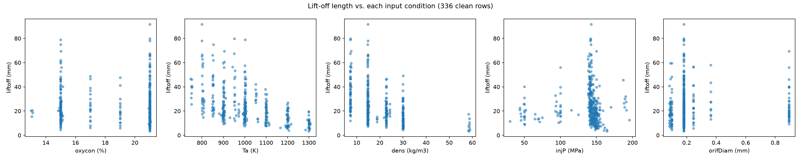
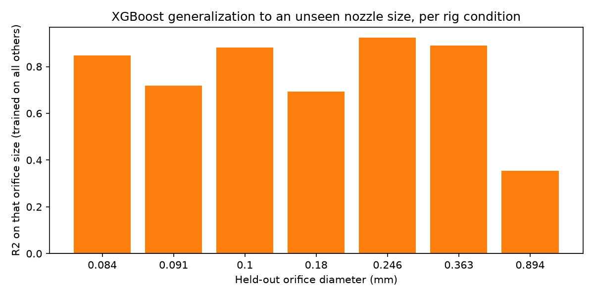
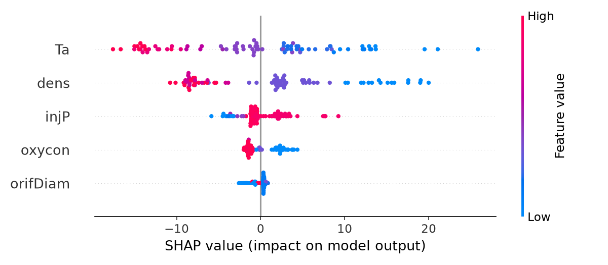

# Project 02 — Spray & Combustion ML

**Status: 🟢 Stages 1-3 complete**

## Engineering problem
Diesel spray lift-off length is a key combustion KPI - it governs mixing before ignition and strongly affects soot formation. Can I predict it from injection/ambient conditions with a model that's also physically interpretable, not just accurate?

## Objective and outcomes
I set out to show that ML on real ECN combustion data can:
- Turn a messy, multi-study experimental table into a clean, usable dataset
- Predict a real combustion KPI (lift-off length) from ambient/injection conditions
- Explain *why* the model predicts what it does (SHAP), and check that against known combustion physics

All 3 stages done: 948 raw rows cleaned to 336 usable rows (with a real data-cleaning bug caught and fixed along the way), XGBoost predicts lift-off length at R2=0.797, and SHAP-derived feature directions matched known combustion physics on all 5 features - the model learned real physics, not a spurious pooled-dataset pattern.

## Physics baseline
Ambient O2 concentration, ambient temperature, ambient density, injection pressure, and nozzle orifice diameter all influence ignition delay and flame stabilization (lift-off length) in a diesel spray.

## Dataset
Engine Combustion Network (ECN), Sandia National Laboratories - the open experimental-data table behind their Diesel Spray Combustion search tool. Freely downloadable, no account required.
- Data search tool: https://ecn.sandia.gov/diesel-spray-combustion/experimental-data-search/
- Direct CSV: https://ecn.sandia.gov/databases/dieseldata.csv
- Column definitions: https://ecn.sandia.gov/diesel-spray-combustion/experimental-data-search/definitions/

## Method
Stage 1: clean the raw CSV (948 rows), select lift-off length as the target (best coverage of the four candidate KPIs), verify physical sensibility with EDA. Stage 2: linear baseline → Random Forest / XGBoost regression. Stage 3: SHAP feature importance, checked against known combustion physics.

## Result
- **All 5 SHAP feature directions matched known combustion physics, with no correction needed:** ambient temperature, O2%, and density all shorten lift-off length (faster ignition kinetics/mixing), injection pressure lengthens it (higher jet velocity pushes the flame downstream), and orifice diameter is genuinely ambiguous - matching exactly where the model's generalization also breaks down (see below). That agreement is the real evidence the model learned physics, not a pooled-dataset artifact - I'd trust this result a lot less if the numbers alone looked good but the directions didn't check out.
- **XGBoost predicts lift-off length at R2=0.797, MAE=4.57mm** on a random 75/25 split. Context on that number: this is real, noisy, multi-institution experimental data pooled from several different rigs, not clean synthetic/simulation output. R2 near 0.8 here is a strong result for combustion KPI regression on data like this - R2 near 1.0 would actually be a red flag for data leakage, not evidence of a better model.
- 336 of 948 rows have every core input (O2%, Ta, density, injection pressure, orifice diameter) and the target present after cleaning
- Injection pressure and orifice diameter cluster around a handful of common test conditions rather than varying continuously - a real constraint on what the model can learn, not something I'm glossing over

| Stage | Task | Key result | Figure |
|---|---|---|---|
| 1 | Data cleaning + EDA | 336/948 clean rows; temperature is the strongest visible driver |  |
| 2 | Regression: linear → RF → XGBoost | XGBoost best (R2=0.797, MAE=4.57mm); generalizes well to 6/7 orifice sizes held out entirely, fails on the 0.894mm orifice (R2=0.354) - a genuinely different, larger atomization regime |  |
| 3 | SHAP feature importance vs. physics | Ta and dens dominate importance; all 5 feature directions matched known combustion chemistry |  |

Full code and my stage-by-stage notes: `code/stage1_data_cleaning.py` … `code/stage3_shap.py` and the matching `stage*_learning_notes.md` files.

**Appendix (exploratory, not a numbered stage):** I also tried validating the tabulated lift-off values against their source OH* chemiluminescence images directly, independent of the CSV. Real result (r=0.95 on 7 of 19 images) and a real open question I haven't resolved (my threshold wasn't the documented ECN measurement definition) - see `code/appendix_image_validation.py` and its notes.

## Folder structure
- `code/` - the 3 stage scripts + the appendix
- `data/` - `ecn_dieseldata.csv` (raw, 786 KB), `ecn_clean_liftoff.csv` (Stage 1's cleaned output), `oh_chemi_images/` (19 source images for the appendix) - all committed directly, small enough not to need a download step
- `results/` - every figure referenced in this README

## Error analysis
Linear MAE=7.63mm, RMSE=11.21mm, R2=0.550 vs. XGBoost MAE=4.57mm, RMSE=7.54mm, R2=0.797 on a random 75/25 split. That number alone overstates confidence though - the leave-one-orifice-out check (Genuine limitations below) shows the real error is condition-dependent: MAE ranges from 2.61mm to 9.25mm depending on which nozzle size is held out.

## Engineering conclusion
Ambient temperature and density dominate lift-off length prediction, together outweighing injection pressure and O2 concentration by roughly 3-4x in SHAP importance - and every feature's direction of effect matched known combustion chemistry without needing any correction. That's the strongest evidence in this project that the model learned real physics rather than a pooled-dataset artifact. The one place it doesn't generalize (the 0.894mm orifice) isn't random noise either - it's a physically distinct, much larger nozzle than the rest of the dataset, and it's also the feature SHAP ranks least important and most directionally ambiguous. The model's strength and its one weak point are both explainable from the same physics, not two unrelated findings.

## Genuine limitations
This table pools many different studies/rigs rather than one controlled sweep. Tested directly with a leave-one-orifice-size-out check (train on every other nozzle size, test only on the held-out one): the model generalizes well to 6 of 7 orifice sizes (R2 0.69-0.92) even completely unseen, but fails on the 0.894mm orifice (R2=0.354) - a real, physically-explainable weak point (that orifice is 5-10x larger than the rest of the dataset, a genuinely different atomization regime), not a vague "small dataset" excuse.

Checked directly rather than assumed: excluding that one orifice size from training improves both accuracy and stability across the rest of the dataset (grouped-CV R2 0.694→0.755, std 0.209→0.137) - it's genuinely dragging down generalization, not just one noisy group among several. For anything beyond a portfolio exercise, the right fix is two separate models per regime, not pooling and accepting the worse number.

## How to reproduce
1. `pip install -r ../../requirements.txt`
2. The data is already in `data/` - no download needed. (It came from `curl -o ecn_dieseldata.csv https://ecn.sandia.gov/databases/dieseldata.csv`, no account required, if you want the raw source.)
3. From `code/`, run `stage1_data_cleaning.py` → `stage2_regression.py` → `stage3_shap.py` in order (`# %%` cell blocks). Stage 1 regenerates `data/ecn_clean_liftoff.csv`, which Stages 2-3 read.

## Source attribution
Data: Engine Combustion Network (ECN), Sandia National Laboratories, and the contributing research institutions whose experiments populate this table (attribution per-row via the table's `refs`/`fileBaseName` columns on the ECN site).

Please cite the ECN and the original experimental paper(s) for any use of this data beyond a learning exercise - see https://ecn.sandia.gov/ for citation guidance.

Independent learning exercise using the public ECN dataset - not affiliated with Sandia National Laboratories or the ECN.
