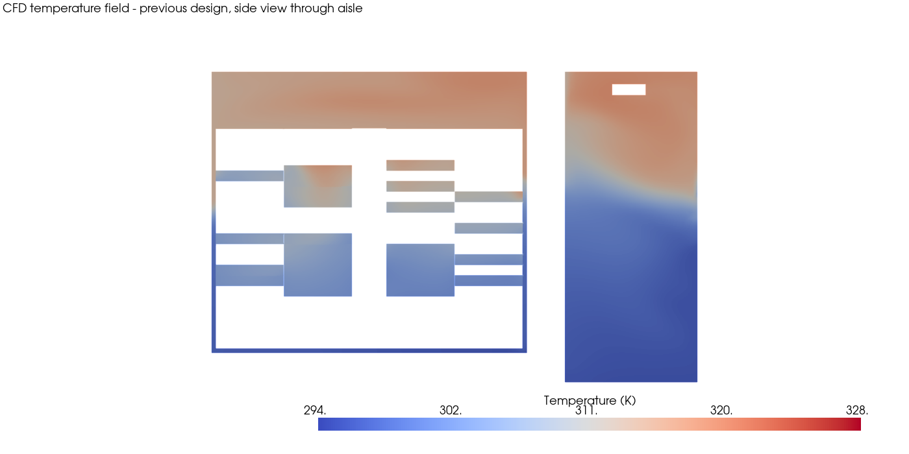
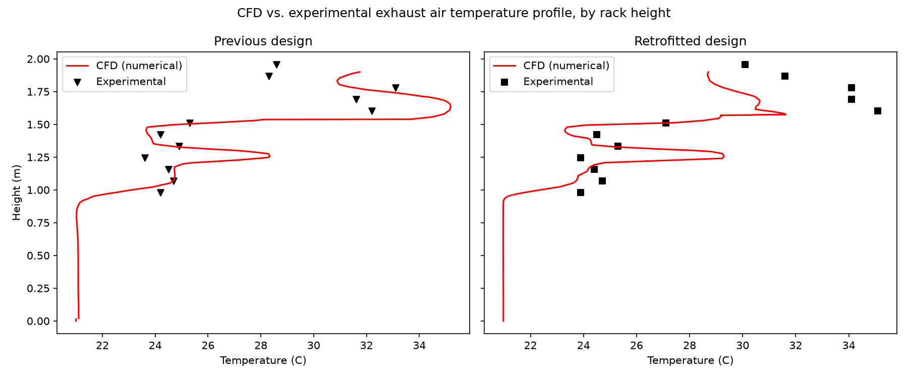
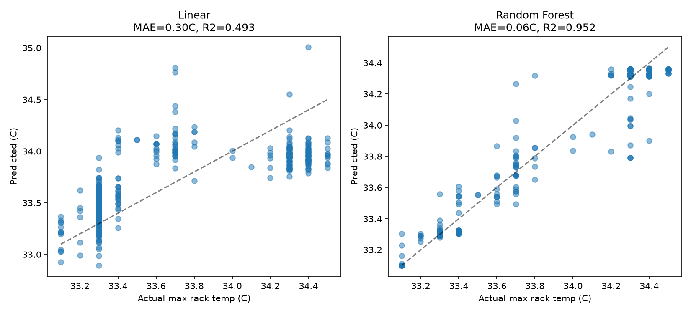
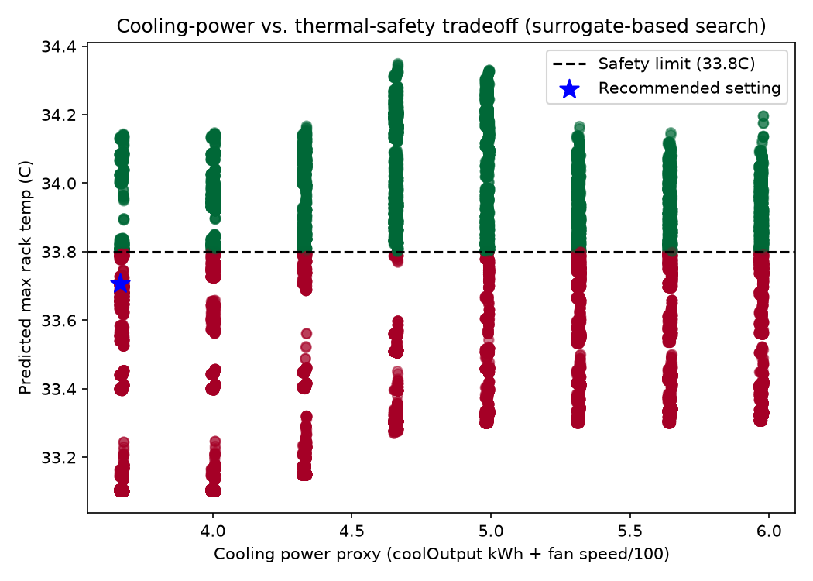

# Project 03 — Data Center Cooling Surrogate

**Status: Stages 1-4 complete**



## Engineering problem
Data center cooling costs real money and every degree of safety margin costs more of it. Can I build a fast surrogate that predicts hotspot temperature from cooling settings, then use it to find a cheaper setting that's still safe - without running a full CFD case for every candidate?

## Objective and outcomes
I set out to show that ML on real ECO-Qube data center data can:
- Validate against real CFD + experimental + live-sensor data before trusting any of it
- Predict a real thermal KPI (max rack-back temperature) from cooling-unit settings, fast enough to search over
- Use that surrogate to find a cheaper-but-still-safe cooling setting
- Wrap the surrogate and optimizer into an interactive engineering dashboard that also flags extrapolation

All 4 stages are complete. Headline result: the optimizer found a setting predicted to hold the same hotspot temperature (33.71C) as the historical average, at 23.5% less cooling power - and I checked that claim against the surrogate's actual accuracy before trusting it, not just reported the number.

## Physics baseline
Cool air intake at rack level, hot exhaust air rising and collecting near the ceiling (buoyancy-driven), cooling-unit airflow/fan speed/return-air temperature governing how much of that heat gets removed.

## Dataset
ECO-Qube EU project (CORDIS 956059), Zenodo record 7035829 - real data center retrofit study, both the original and retrofitted cooling designs.
- CFD/experimental data: https://zenodo.org/records/7035829
- Small files (experimental temps, CFD-vs-experiment comparison CSVs, live sensor logs, ~1.7MB) committed directly in `data/`
- Large files (solved OpenFOAM CFD case, 611MB extracted) NOT committed - see `data/cfd_field/README.md`

## Method
Stage 1: CFD-vs-experiment validation (exhaust temperature profile) + live sensor exploration (rack-back temperature by height), for both designs. Stage 1b: render the actual solved 3D CFD temperature field. Stage 2: Random Forest surrogate for max rack-back temperature from cooling settings. Stage 3: grid search for minimum cooling power meeting a safety constraint, bounded to the surrogate's trained range. Stage 4: interactive Streamlit dashboard wrapping Stages 2-3 into a visible decision-support interface.

## Result
| Stage | Task | Key result | Figure / output |
|---|---|---|---|
| 1 | CFD vs. experiment + sensors | Both agree: hot band ~1.5-1.9m height, hotspot near U34-40 |  |
| 1b | 3D CFD field render | Real hot-air-rises pattern, localized hotspot at rack exhaust |  |
| 2 | Thermal KPI surrogate | Random Forest R2=0.952, but flagged: narrow 1.4C training window, not a designed sweep |  |
| 3 | Cooling-power optimization | 23.5% less cooling power for the same predicted hotspot temp, search bounded to trained range |  |
| 4 | Interactive surrogate dashboard | Hotspot prediction, safe/unsafe check, bounded cooling recommendation, extrapolation warning |  |

## Stage 4 — Interactive surrogate dashboard

The dashboard turns the surrogate into a small engineering decision-support prototype instead of leaving it as a model script.


> **Dashboard preview:** this is a static README representation of the actual Streamlit interface and documented project result. Run the app below for the live sliders, prediction and optimization workflow.

### Predict hotspot
Adjust the five cooling/air-side inputs and the dashboard returns:

- predicted maximum rack temperature;
- selected safety limit;
- temperature margin to the limit;
- safe / unsafe decision;
- explicit warning if any input is outside the surrogate's trained range;
- comparison chart for predicted hotspot versus safety limit.

### Recommend cooling setting
Choose the maximum acceptable rack temperature and grid-search resolution. The dashboard then searches **only inside the bounded surrogate range** and returns:

- whether a feasible solution exists;
- predicted hotspot temperature;
- cooling-power proxy;
- recommended airflow, cooling output, fan speed, return-air temperature and supply-air temperature;
- the corresponding surrogate training-range limits for every recommended variable.

### Model / data context
A third tab keeps the model limitations visible:

- model type and training-row count;
- target definition;
- 2nd percentile / median / 98th percentile operating ranges;
- target history;
- reminder that this surrogate complements CFD/experimental validation rather than replacing it.

### Run the dashboard
From the repository root:

```bash
pip install -r requirements.txt
streamlit run projects/03-ecoqube-datacenter-cooling/code/stage4_dashboard.py
```

Streamlit will provide a local browser URL. The dashboard reads `data/merged_surrogate_dataset.csv`, trains the Random Forest surrogate, and exposes the prediction and optimization workflow interactively.

Full code and my stage-by-stage notes: `code/stage1_data_exploration.py` … `code/stage4_dashboard.py` and the matching `stage*_learning_notes.md` files.

## Error analysis
Stage 2's R2=0.952 needs context, not just quoting: the target (max rack temp) only spans 33.1-34.5C in this dataset - roughly 2 hours of near-steady logged operation per design, not a designed sweep across genuinely different cooling regimes. The linear baseline's weaker R2=0.493 is the more honest signal of how much real, generalizable structure is in this data; the Random Forest's higher number partly reflects how smooth and autocorrelated a 10-second-interval time series is, not pure predictive power on new conditions.

## Engineering conclusion
Three independent data sources - the CFD field, the CFD/experimental exhaust profile, and the live rack sensors - all agree on where the heat actually is (rising toward the ceiling, concentrated near U34-40). That agreement is what makes me willing to trust the Stage 2 surrogate at all, given its narrow training window. The Stage 3 optimization result (23.5% cooling-power reduction for the same predicted safety margin) is a useful finding within this exercise, but I deliberately bounded the search to the surrogate's trained range rather than let it recommend something it has no evidence for. Stage 4 keeps that constraint visible in the user interface through explicit range checks and bounded optimization.

## Genuine limitations
- Stage 2's surrogate is trained on a narrow steady-state window (33.1-34.5C), not a designed experiment across different loads/cooling regimes - a real deployment would need data spanning actual operating extremes, not just what happened to be logged over ~2 hours.
- The Stage 1b CFD field render is for the previous ("old") design only - the retrofitted design's equivalent solved 3D field wasn't in the same archive, and downloading/searching for it separately wasn't worth the cost for this project. The 1D exhaust-profile and sensor comparisons in Stage 1 do cover both designs.
- "Cooling power proxy" (coolOutput + fan speed/100) is a convenience metric I defined for this exercise, not a validated energy-cost model - a real optimization would need actual power/cost data per component.
- The Streamlit app is a portfolio decision-support prototype, not a production controls interface.

## How to reproduce
1. `pip install -r ../../requirements.txt` (includes `pyvista` for the CFD field render and `streamlit` for the dashboard)
2. Small data is already in `data/` - no download needed for Stages 1 (Part A/B), 2, 3, 4.
3. For Stage 1b's CFD field render, download the large archive per `data/cfd_field/README.md` first.
4. From `code/`, run in order: `stage1_data_exploration.py` → `stage1b_cfd_field_visualization.py` (needs step 3) → `stage2_surrogate_model.py` → `stage3_optimization.py`.
5. Launch Stage 4 with `streamlit run stage4_dashboard.py`.

## Source attribution
Data: ECO-Qube EU project (CORDIS grant 956059) and contributing partners - the retrofit study behind Zenodo record 7035829.

Citation: see the Zenodo record (https://zenodo.org/records/7035829) for the dataset's own citation guidance.

Independent learning exercise using the public ECO-Qube dataset - not affiliated with the ECO-Qube project or its partners.
