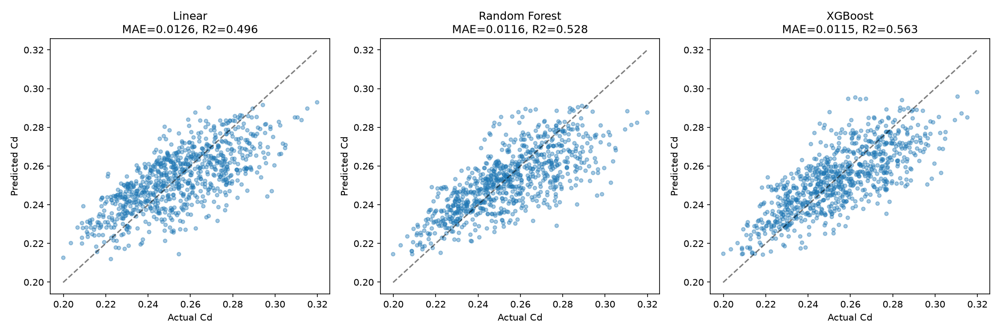
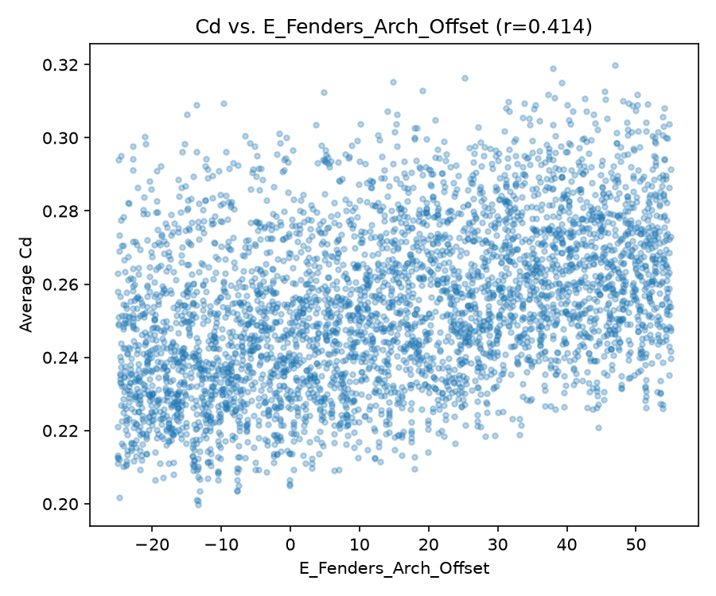
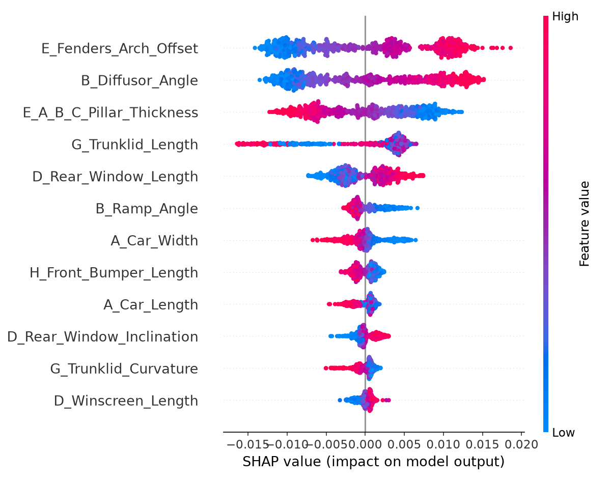

# Project 04 — Vehicle Aerodynamics AI

**Status: 🟡 Stages 1-3 complete, Stage 4 (real geometry) pending data download**

## Engineering problem
Drag coefficient is one of the first things checked in early-stage vehicle design, and running full CFD on every candidate shape is expensive. Can I predict Cd from geometry descriptors fast enough to screen designs, and explain which geometric features actually drive the prediction?

## Objective and outcomes
I set out to show that ML on real DrivAerNet++ data can:
- Explore a real automotive design space (4165 CFD-simulated car geometries)
- Predict Cd from geometry parameters, honestly reporting how much variance that representation can actually explain
- Explain the model with SHAP, checked against real automotive aerodynamics

Stages 1-3 done: EDA, RF/XGBoost regression, SHAP. The honest headline: 23 scalar geometry parameters only get XGBoost to R2=0.563 - a real, useful result, but a much weaker one than Projects 1-3, because scalar summary parameters genuinely can't capture full 3D shape. That gap is exactly why Stage 4 (real per-car geometry images) is queued next, not an afterthought.

## Physics baseline
Drag coefficient (Cd) is governed by pressure and skin-friction drag integrated over the entire car surface - underbody flow, wheel-well/fender flow separation, greenhouse shape, and rear-end flow attachment/separation (diffuser angle, trunklid geometry) all contribute.

## Dataset
DrivAerNet++ (Elrefaie et al., NeurIPS 2024) - 8150 car designs total, 4165 used here via the parametric CSV. Real upstream repo: https://github.com/Mohamedelrefaie/DrivAerNet (the earlier-linked `roharon/drivaernet` is just a fork/mirror of this).
- Parametric data (used here, 1.4MB, committed directly): https://raw.githubusercontent.com/Mohamedelrefaie/DrivAerNet/main/ParametricModels/DrivAerNet_ParametricData.csv
- Full dataset (39TB, meshes/CFD/point clouds via Globus): https://dataverse.harvard.edu/dataverse/DrivAerNet
- Sketches (27-37MB, gated behind a one-time guestbook form): https://doi.org/10.7910/DVN/JRHNAX
- **License: CC BY-NC 4.0 - non-commercial use only.**

## Method
Stage 1: EDA on 23 geometry parameters + Cd/Cl. Stage 2: linear baseline → Random Forest → XGBoost for Cd. Stage 3: SHAP feature importance, checked against real aero physics. Stage 4 (pending): real per-car 2D sketch images, matched to design ID, to add actual shape information beyond the 23 scalar summaries.

## Result
| Stage | Task | Key result | Figure |
|---|---|---|---|
| 1 | Design-space EDA | Cd range 0.20-0.32 (realistic); top correlate is fender/wheel-arch offset (r=0.41), but wide scatter |  |
| 2 | Cd regression | XGBoost best: R2=0.563, MAE=0.0115 (52% of Cd's own std - real but modest) |  |
| 3 | SHAP vs. physics | Fender offset + diffuser angle dominate, matching known aero drag drivers |  |

Full code and my stage-by-stage notes: `code/stage1_design_space_eda.py` … `code/stage3_shap.py` and the matching `stage*_learning_notes.md` files.

## Error analysis
XGBoost's MAE (0.0115) is 52% of Cd's own standard deviation (0.022) across the dataset - real predictive signal, clearly better than guessing the mean every time, but not close to design-screening-grade accuracy. The scatter plot shows classic regression-to-the-mean at the extremes (Cd<0.22 or >0.29), which is the visual signature of an input representation that doesn't carry enough information to distinguish unusual designs from typical ones.

## Engineering conclusion
The three top SHAP features (fender/wheel-arch offset, diffuser angle, A/B/C-pillar thickness) match known automotive drag physics and agree with Stage 1's raw correlation ranking - so the model is learning something real, not noise. But the honest ceiling here is the input representation: 23 scalar parameters summarize shape, they don't fully describe it. Cd is an integral over the entire 3D surface, and a lot of that surface detail simply isn't in these 23 numbers. That's not a modeling failure to fix with better hyperparameters - it's a genuine information-content limit, and it's exactly why real geometry data (Stage 4) is the right next step rather than more tuning on the same features.

## Genuine limitations
- The full 39TB mesh/CFD/point-cloud dataset isn't used here - it requires Globus and is far beyond what's reasonable for a portfolio repo. The 1.4MB parametric CSV is real CFD-derived data, just the tabular summary, not the 3D geometry itself.
- Stage 4's sketch images are gated behind a one-time Harvard Dataverse guestbook form (name/email/purpose of use) - a real access step, not something to route around programmatically.
- Pillar thickness's negative SHAP effect on Cd has a plausible physical explanation (smoother greenhouse transition) but isn't confirmed against actual geometry yet - stated as an open question, not resolved.

## How to reproduce
1. `pip install -r ../../requirements.txt`
2. The parametric data is already in `data/` - no download needed for Stages 1-3.
3. From `code/`, run `stage1_design_space_eda.py` → `stage2_cd_regression.py` → `stage3_shap.py` in order (`# %%` cell blocks).
4. For Stage 4, download `sketches-CannyEdge.zip` from https://doi.org/10.7910/DVN/JRHNAX (requires the guestbook form).

## Source attribution
Dataset: DrivAerNet++ - Elrefaie, M., Morar, F., Ahmed, F., Ahmed, A. "DrivAerNet++: A Large-Scale Multimodal Car Dataset with Computational Fluid Dynamics Simulations and Deep Learning Benchmarks," NeurIPS 2024. https://arxiv.org/abs/2406.09624

License: CC BY-NC 4.0 (non-commercial use only) - https://creativecommons.org/licenses/by-nc/4.0/

Independent learning exercise using the public DrivAerNet++ dataset - not affiliated with the DrivAerNet++ authors.
